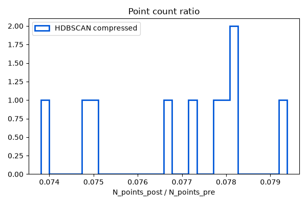
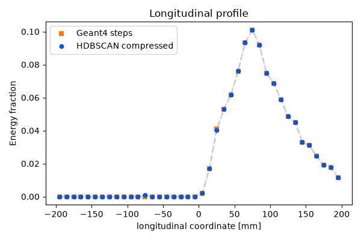

<div class="hero-shell" markdown>

<div markdown>

<div class="hero" markdown>

# step2point

<div class="tagline" markdown>
A library for turning detailed calorimeter shower deposits into compact point-cloud representations usable for ML-based fast simulation.
</div>

</div>

</div>

<div markdown>
{ .hero-figure }
</div>

</div>


## Motivation

Detailed Geant4 calorimeter simulation gives the most faithful picture of how showers develop in matter, but it is also too detailed to serve directly as a practical training representation for generative models:

- the step-level representation is **large**
- the voxelised representation is **sparse**
- the number of points is **irregular** from shower to shower
- detector geometry is **non-trivial** and hard to regularize cleanly

Existing approaches often start by very fine-granularity voxelisation and turn each non-empty voxel into a point, making not necessarily an optimal representation.

`step2point` is built around an idea:

<div class="highlight-box" markdown>
Analyse the shower as a **point cloud**, reducing it to a smaller set of points in a way that respects calorimeter response.
</div>


## Input/output

<div class="grid cards" markdown>

-   **Input: detailed shower deposits**

    Shower: `x, y, z, E`,
    optionally `t`, `cell_id`, particle provenance, or detector metadata, ...

-   **Output: compressed point cloud shower**

    Shower represented with fewer points, keeping the same schema `x, y, z, E`.

-   **Compression quality: physics validation**

    Compression is never a purely geometric simplification. Every algorithm should be judged by what it preserves and what it intentionally changes.

</div>

## Compression quality

In `step2point`, a good representation is **not** just one with fewer points.

It should reduce complexity while preserving the observables that matter for calorimeter studies and later detector-level use. In practice in this library it means paying attention to:

- total deposited energy
- longitudinal shower development
- radial shower development
- azimuthal structure
- first and second moments of the shower
- detector-aware quantities such as cell-energy spectra when `cell_id` is available

At the same time, some quantities are expected to change by construction, especially the number of points and the individual point-energy spectrum.

### Measured on the ODD gamma sample

These figures are generated by the repository's validation code from the committed 10-shower, 10 GeV ODD photon sample
and its HDBSCAN-compressed reference output. They are project data, not illustrative curves.

Across the sample, HDBSCAN reduces **35,820 deposits to 2,755 points**: 7.69% of the original points remain, a 92.31%
reduction. The per-shower total-energy ratio differs from one by at most `3.6e-9`.

<div class="benchmark-grid">
  <figure>
    
    <figcaption><strong>Compression.</strong> Each shower retains about 7.4–7.9% of its original deposits.</figcaption>
  </figure>
  <figure>
    
    <figcaption><strong>Expected change.</strong> Merging deposits shifts the individual point-energy spectrum.</figcaption>
  </figure>
  <figure>
    
    <figcaption><strong>Longitudinal profile.</strong> The compressed result follows the Geant4-step reference.</figcaption>
  </figure>
  <figure>
    
    <figcaption><strong>Radial profile.</strong> The energy-weighted shower width and tail remain closely aligned.</figcaption>
  </figure>
</div>

The plots can be regenerated with the [validation plotting workflow](validation.md#validation-plot-generation).

## Quickstart

```bash
pip install -e .[dev]
pytest -q
```

See **Getting started** for a simple end-to-end Python example, and **Future C++ backend** for the planned path toward a shared C++ algorithm layer.
