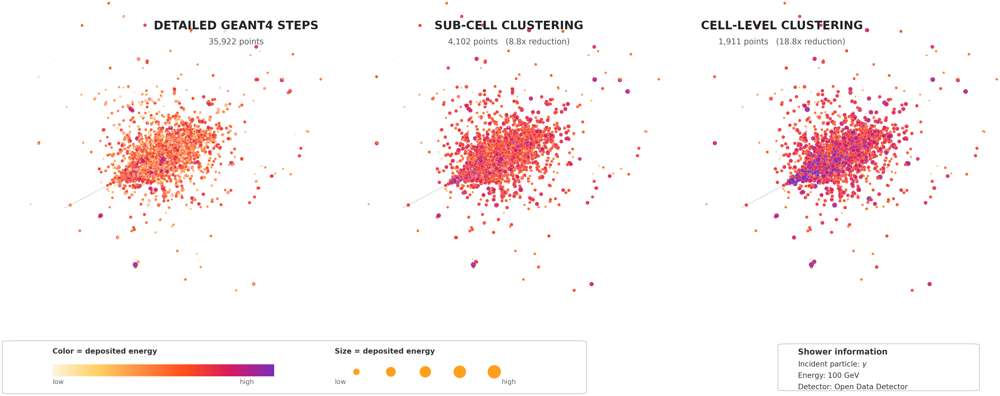
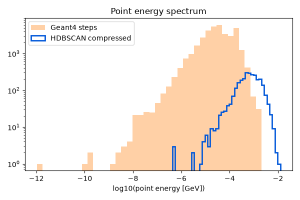
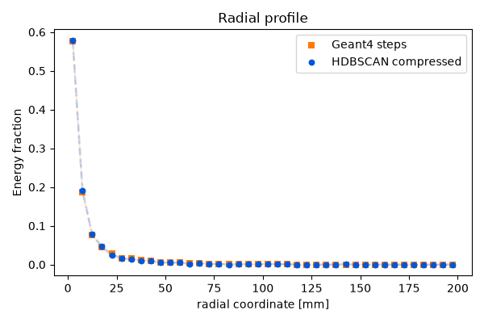

<div class="hero-shell" markdown>

<div markdown>

<div class="hero" markdown>

# step2point

<div class="tagline" markdown>
A library for turning detailed calorimeter shower deposits into compact point-cloud representations usable for ML-based fast simulation.
</div>

</div>

</div>

<div markdown>
{ .hero-figure }
</div>

</div>


## Motivation

Detailed Geant4 calorimeter simulation gives the most faithful picture of how showers develop in matter, but it is also too detailed to serve directly as a practical training representation for generative models:

- the step-level representation is **large**
- the voxelised representation is **sparse**
- the number of points is **irregular** from shower to shower
- detector geometry is **non-trivial** and hard to regularize cleanly

Existing approaches often start by very fine-granularity voxelisation and turn each non-empty voxel into a point, making not necessarily an optimal representation.

`step2point` is built around an idea:

<div class="highlight-box" markdown>
Analyse the shower as a **point cloud**, reducing it to a smaller set of points in a way that respects calorimeter response.
</div>


## Input/output

<div class="grid cards" markdown>

-   **Input: detailed shower deposits**

    Shower: `x, y, z, E`,
    optionally `t`, `cell_id`, particle provenance, or detector metadata, ...

-   **Output: compressed point cloud shower**

    Shower represented with fewer points, keeping the same schema `x, y, z, E`.

-   **Compression quality: physics validation**

    Compression is never a purely geometric simplification. Every algorithm should be judged by what it preserves and what it intentionally changes.

</div>

## Compression quality

In `step2point`, a good representation is **not** just one with fewer points.

It should reduce complexity while preserving the observables that matter for calorimeter studies and later detector-level use. In practice in this library it means paying attention to:

- total deposited energy
- longitudinal shower development
- radial shower development
- azimuthal structure
- first and second moments of the shower
- detector-aware quantities such as cell-energy spectra when `cell_id` is available

At the same time, some quantities are expected to change by construction, especially the number of points and the individual point-energy spectrum.

### What changes — and what should stay stable

<div class="benchmark-panel">
  <section class="benchmark-card benchmark-card--change">
    <span class="benchmark-badge">EXPECTED TO CHANGE</span>
    <h4>Point representation</h4>
    <figure>
    
      <figcaption>The point-energy spectrum shifts as deposits are merged into a smaller representation.</figcaption>
    </figure>
    <div class="benchmark-more">
      <span class="benchmark-plus" aria-hidden="true">+</span>
      <div>
        <strong>Other changing observables</strong>
        <ul>
          <li>point count and compression ratio</li>
          <li>individual point positions</li>
          <li>cluster assignments and representative cell IDs</li>
        </ul>
      </div>
    </div>
  </section>

  <section class="benchmark-card benchmark-card--stable">
    <span class="benchmark-badge">SHOULD REMAIN STABLE</span>
    <h4>Transverse shower structure</h4>
    <figure>
    
      <figcaption>The energy-weighted transverse profile remains aligned with the detailed-step reference.</figcaption>
    </figure>
    <div class="benchmark-more">
      <span class="benchmark-plus" aria-hidden="true">+</span>
      <div>
        <strong>Other stable observables</strong>
        <ul>
          <li>total deposited energy</li>
          <li>longitudinal and time profiles</li>
          <li>energy-weighted centroids and moments</li>
        </ul>
      </div>
    </div>
  </section>
</div>

<p class="benchmark-source">
Real output from the HDBSCAN regression example in
<a href="https://github.com/fast-sim/step2point/blob/main/tests/integration/test_algorithm_hdbscan_loose_regression.py"><code>test_algorithm_hdbscan_loose_regression.py</code></a>;
regenerate it with the <a href="validation/#validation-plot-generation">validation plotting workflow</a>.
</p>

## Quickstart

```bash
pip install -e .[dev]
pytest -q
```

See **Getting started** for a simple end-to-end Python example, and **Future C++ backend** for the planned path toward a shared C++ algorithm layer.
