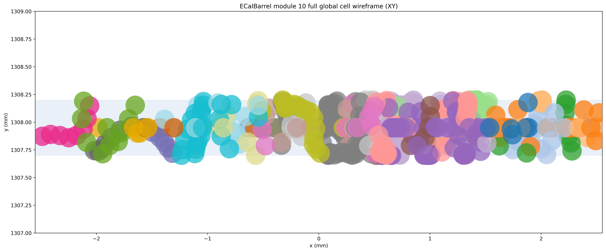
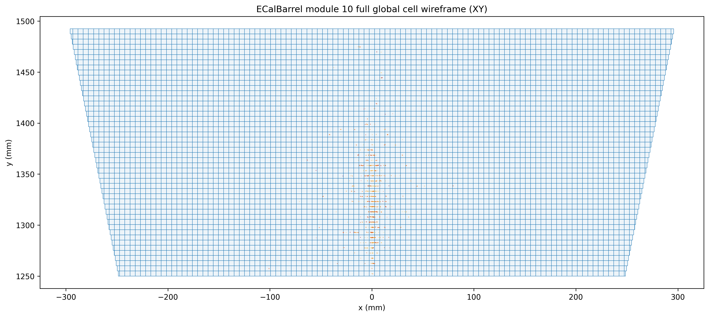

# Validation

Compression is only useful if we can say clearly what it preserves and what it changes.

For that reason, `step2point` separates validation into two categories.

## Quantities that should stay unchanged

These are the observables that define whether the compressed shower still behaves like the original shower.

### Total shower energy

A natural diagnostic is the per-shower ratio:

```text
E_post / E_pre
```

Using a ratio is usually more informative than looking at raw energies directly, because it factors out the broad physical energy range in the dataset.

### Shower profiles

The compressed shower should preserve the broad shape of the shower:

- longitudinal profile
- radial profile
- phi profile

### Shower moments

Useful compact summaries are:

- first longitudinal moment
- second longitudinal moment
- first radial moment
- second radial moment

### Detector-aware quantities

If `cell_id` is present, detector-aware checks become especially important:

- distribution of `log(cell_energy)`
- ratio of the number of cells before and after compression

## Quantities that are expected to change

Some changes are not only acceptable but are the whole point of compression.

### Point-energy spectrum

The distribution of individual point energies will change because points are being merged.

### Number of points

The ratio

```text
N_points_post / N_points_pre
```

is one of the central performance indicators of a compression algorithm.

## Example inspection workflow

For shower inspection, use `examples/inspect_showers.py`. The script always produces a dataset-level observables, and it also produces single-shower plots if `--shower-index` is given.

Note:
`PYTHONPATH=src` is only needed when running directly from a source checkout without installing the package first. If you already ran `pip install -e .[dev]`, you can drop that prefix and use `python ...` directly.

Dataset-level only:

```bash
PYTHONPATH=src python examples/inspect_showers.py \
  --input tests/data/ODD_gamma_10ev_theta90deg_phi0deg_posX0mmY1250mmZ0mm_10GeV.h5 \
  --axis 0 1 0 \
  --outdir outputs/inspect_gamma
```

Dataset plus single-shower plots:

```bash
PYTHONPATH=src python examples/inspect_showers.py \
  --input tests/data/ODD_gamma_10ev_theta90deg_phi0deg_posX0mmY1250mmZ0mm_10GeV.h5 \
  --shower-index 0 \
  --axis 0 1 0 \
  --outdir outputs/inspect_gamma
```

Recommended axis override for these front-face ODD samples:

```bash
PYTHONPATH=src python examples/inspect_showers.py \
  --input tests/data/ODD_gamma_10ev_theta90deg_phi0deg_posX0mmY1250mmZ0mm_10GeV.h5 \
  --shower-index 0 \
  --axis 0 1 0 \
  --outdir outputs/inspect_gamma
```

Expected outputs:

- `dataset_observables.png`
- `shower_<id>_projections.png`
- `shower_<id>_distributions.png`
- `shower_<id>_overview.png`

## Detector cell inspection

For detector-aware debugging of merging strategies, use `examples/plot_detector_cells.py`.

This workflow reads the DD4hep compact XML and factory-derived barrel geometry (Open Data Detector-like PolyhedraBarrel), then optionally overlays a shower from HDF5 or EDM4hep ROOT on top of:

- module envelopes
- layer outlines
- cell footprints

Typical use, to see the entire detector:

```bash
PYTHONPATH=src python examples/plot_detector_cells.py \
  --compact-xml OpenDataDetector/xml/OpenDataDetector.xml \
  --collection ECalBarrelCollection \
  --draw-modules \
  --overlay-input tests/data/ODD_gamma_10ev_theta90deg_phi0deg_posX0mmY1250mmZ0mm_10GeV.h5 \
  --overlay-shower-index 0 \
  --outdir outputs/detector_cells
```

Zoomed cell view for one module:

```bash
PYTHONPATH=src python examples/plot_detector_cells.py \
  --compact-xml OpenDataDetector/xml/OpenDataDetector.xml \
  --collection ECalBarrelCollection \
  --draw-cells \
  --overlay-input tests/data/ODD_gamma_10ev_theta90deg_phi0deg_posX0mmY1250mmZ0mm_10GeV.h5 \
  --overlay-shower-index 0 \
  --outdir outputs/detector_cells \
  --module 10
```

Zoomed view with cells spanning only over the sensitive material:

```bash
PYTHONPATH=src python examples/plot_detector_cells.py \
  --compact-xml OpenDataDetector/xml/OpenDataDetector.xml \
  --collection ECalBarrelCollection \
  --draw-cells \
  --sensitive-only \
  --overlay-input tests/data/ODD_gamma_10ev_theta90deg_phi0deg_posX0mmY1250mmZ0mm_10GeV.h5 \
  --overlay-shower-index 0 \
  --outdir outputs/detector_cells \
  --module 10
```

Manual ranges can be controlled with one unified set of limits:

- `--xlim`
- `--ylim`
- `--zlim`

These limits are used consistently to:

- select which detector geometry is drawn
- select which overlay points are kept
- set the axis zoom

Example with a manual detector/debug window:

```bash
PYTHONPATH=src python examples/plot_detector_cells.py \
  --compact-xml OpenDataDetector/xml/OpenDataDetector.xml \
  --collection ECalBarrelCollection \
  --draw-cells \
  --sensitive-only \
  --overlay-input tests/data/ODD_gamma_10ev_theta90deg_phi0deg_posX0mmY1250mmZ0mm_10GeV.h5 \
  --overlay-shower-index 0 \
  --outdir outputs/detector_cells \
  --module 10 \
  --xlim -7.65 7.65 \
  --ylim 1307 1319 \
  --zlim -7.65 7.65
```

There is also a `--debug` flag that allows to print the decoded cell ID bitfields to investigate visually the compression algorithms:


```bash
PYTHONPATH=src python examples/plot_detector_cells.py \
  --compact-xml OpenDataDetector/xml/OpenDataDetector.xml \
  --collection ECalBarrelCollection \
  --draw-cells \
  --sensitive-only \
  --overlay-input tests/data/ODD_gamma_10ev_theta90deg_phi0deg_posX0mmY1250mmZ0mm_10GeV_merge_within_cell_reference.h5 \
  --overlay-shower-index 0 \
  --outdir outputs/detector_cells \
  --module 10 \
  --xlim -2.55 2.55 \
  --ylim 1307 1319 \
  --zlim -2.55 2.55 \
  --debug
```

## Clustering debug mode

For cluster-level debugging, `examples/run_step2point_pipeline.py` can also write a debug HDF5 that keeps the original shower points and adds a per-point cluster label.

This is useful when you want to answer questions like:

- which original steps were merged into the same cell-level cluster
- whether nearby points in `XY`, `XZ`, or `ZY` really belong to one cluster
- how a clustering algorithm behaves inside one selected detector window (e.g. within cell, across cells, ...)

### Produce a debug HDF5

Use `--debug-events` with one or more (0-based) shower indices:

```bash
python examples/run_step2point_pipeline.py \
  --input tests/data/ODD_gamma_10ev_theta90deg_phi0deg_posX0mmY1250mmZ0mm_10GeV.h5 \
  --algorithm merge_within_regular_subcell \
  --compact-xml OpenDataDetector/xml/OpenDataDetector.xml \
  --collection-name ECalBarrelCollection \
  --grid-x 5 \
  --grid-y 5 \
  --position-mode weighted \
  --output outputs/pipeline_gamma_regular_subcell_5x5_debug \
  --debug-events 0 3 7
```

This writes the normal compressed output:

- `compressed_merge_within_regular_subcell.h5`

and, in addition, a debug file:

- `debug_merge_within_regular_subcell.h5`

The debug HDF5:

- keeps the original uncompressed points for the selected showers
- adds `steps/cluster_label`, one label per original point
- stores `debug_output=True` and `debug_event_indices=[...]` as file metadata

`--debug-events` accepts multiple indices. Inside the debug HDF5, `--overlay-shower-index` refers to the position within the selected subset, not the original dataset index. For example:

- `--debug-events 0 3 7`
- `--overlay-shower-index 0` means original shower `0`
- `--overlay-shower-index 1` means original shower `3`
- `--overlay-shower-index 2` means original shower `7`

### Plot a debug HDF5

When `examples/plot_detector_cells.py` receives a debug HDF5 as `--overlay-input`, it detects `steps/cluster_label` automatically and colors points by cluster label instead of energy.

```bash
python examples/plot_detector_cells.py \
  --compact-xml OpenDataDetector/xml/OpenDataDetector.xml \
  --collection ECalBarrelCollection \
  --draw-cells \
  --sensitive-only \
  --overlay-input tests/data/ODD_gamma_10ev_theta90deg_phi90deg_posX0mmY1250mmZ0mm_100GeV_merge_within_regular_subcell_5x5_weighted_debug.h5 \
  --overlay-shower-index 0 \
  --outdir outputs/detector_regular_subcell_5x5_debug \
  --module 10 \
  --xlim -2.55 2.55 \
  --ylim 1307 1309 \
  --zlim -2.55 2.55 \
```

Typical debugging workflow:

- first produce the debug HDF5 for one or a few suspicious showers
- then use `--module`, `--layer`, and the `*lim` ranges to isolate one region
- inspect whether points sharing one displayed color really should correspond to the same cluster

Example screenshots for the `100 GeV` regular-subcell debug workflow:

{ width="70%" }

{ width="70%" }

The views below are all `XY` projections:

### Module envelopes with shower overlay


### Module 10 cell view with shower verlay



### Module 10 sensitive-only cell view (zoomed-in) for input file

{ width="75%" }

### Module 10 sensitive-only cell view (zoomed-in) for `merge_within_cell` compression

{ width="30%" }

## Presentation-style 3D shower displays

For publication or PR-style 3D renders, use `examples/render_shower_display.py`. The same script supports one, two, or three inputs and chooses the appropriate layout automatically.

Single shower:

```bash
python examples/render_shower_display.py \
  --input tests/data/ODD_gamma_10ev_theta90deg_phi0deg_posX0mmY1250mmZ0mm_10GeV.h5 \
  --shower-index 0 \
  --out outputs/gamma_display.png \
  --crop-percentile 70
```

Two-shower comparison:

```bash
python examples/render_shower_display.py \
  --input full.h5 compressed.h5 \
  --panel-title "Detailed Geant4 Steps" "Final Compressed Cloud" \
  --shower-index 0 \
  --out outputs/gamma_comparison.png \
  --crop-percentile 70
```

Three-shower comparison:

```bash
python examples/render_shower_display.py \
  --input full.h5 subcell.h5 compressed.h5 \
  --panel-title "Detailed Geant4 Steps" "Sub-cell Clustering" "Final Compressed Cloud" \
  --shower-index 0 \
  --out outputs/gamma_triptych.png \
  --crop-percentile 70
```

Useful options:

- `--crop-percentile 70`
  tightens the view to the shower core using cylindrical energy containment around the shower axis
- `--panel-title ...`
  sets explicit captions for the 2- and 3-panel layouts
- `--axis AX AY AZ`
  overrides the incident direction when you do not want to infer it from primary momentum

## Validation plot generation

Use `examples/generate_validation_plots.py` in two auto-detected modes:

- one `--input` file:
  the script reruns the chosen compression algorithm and compares original vs compressed
- two or more `--input` files:
  the script assumes the later files are already produced outputs, uses the first file as the reference, and only makes comparison plots

Example: recompress and validate in one step

```bash
python examples/generate_validation_plots.py \
  --input tests/data/ODD_gamma_10ev_theta90deg_phi0deg_posX0mmY1250mmZ0mm_10GeV.h5 \
  --algorithm merge_within_cell \
  --outdir outputs/plots_merge_within_cell
```

Example: compare an existing compressed output without recompressing

```bash
python examples/generate_validation_plots.py \
  --input \
    tests/data/ODD_gamma_10ev_theta90deg_phi0deg_posX0mmY1250mmZ0mm_10GeV.h5 \
    outputs/pipeline_merge_within_cell/compressed_merge_within_cell.h5 \
  --outdir outputs/plots_compare_merge_within_cell
```

## Units used in the plots

The example HDF5 files in this repository are produced by [step2point dataset repository](https://gitlab.cern.ch/fastsim/step2point/-/tree/v1.1.0?ref_type=tags), which preserves the EDM4hep values directly:

- deposited energy is plotted as `GeV`
- time is plotted as `ns`
- positions and shower-shape coordinates are plotted as `mm`

NOTE:
This matters only for axis labels and interpretation of the plots. The reclustering/compression code itself does not assume a special unit system: it preserves the units present in the input arrays. If an input dataset used different but internally consistent units, the compressed output would remain in the same units.

# Validation results

## EM showers

Animation below shows an example of a single electromagnetic shower:

{ .animation-gamma }

Single-shower inspection outputs produced with `--shower-index 0` on the gamma sample:

### Projections


### Distributions


### Overview


### Dataset observables matrix


## hadronic showers

Animation below shows an example of a single hadronic shower:

{ .animation-pion }

Single-shower inspection outputs produced with `--shower-index 0 --axis 0 1 0` on the pion sample:

### Projections


### Distributions


### Overview


### Dataset observables


