# Validation

Compression is only useful if we can say clearly what it preserves and what it changes.

For that reason, `step2point` separates validation into two categories.

## Quantities that should stay unchanged

These are the observables that define whether the compressed shower still behaves like the original shower.

### Total shower energy

A natural diagnostic is the per-shower ratio:

```text
E_post / E_pre
```

Using a ratio is usually more informative than looking at raw energies directly, because it factors out the broad physical energy range in the dataset.

### Shower profiles

The compressed shower should preserve the broad shape of the shower:

- longitudinal profile
- radial profile
- phi profile

### Shower moments

Useful compact summaries are:

- first longitudinal moment
- second longitudinal moment
- first radial moment
- second radial moment

### Detector-aware quantities

If `cell_id` is present, detector-aware checks become especially important:

- distribution of `log(cell_energy)`
- ratio of the number of cells before and after compression

## Quantities that are expected to change

Some changes are not only acceptable but are the whole point of compression.

### Point-energy spectrum

The distribution of individual point energies will change because points are being merged.

### Number of points

The ratio

```text
N_points_post / N_points_pre
```

is one of the central performance indicators of a compression algorithm.

## Example inspection workflow

For shower inspection, use `examples/inspect_showers.py`. The script always produces a dataset-level observables, and it also produces single-shower plots if `--shower-index` is given.

Note:
`PYTHONPATH=src` is only needed when running directly from a source checkout without installing the package first. If you already ran `pip install -e .[dev]`, you can drop that prefix and use `python ...` directly.

Dataset-level only:

```bash
PYTHONPATH=src python examples/inspect_showers.py \
  --input tests/data/ODD_gamma_10ev_theta90deg_phi0deg_posX0mmY1250mmZ0mm_10GeV.h5 \
  --axis 0 1 0 \
  --outdir outputs/inspect_gamma
```

Dataset plus single-shower plots:

```bash
PYTHONPATH=src python examples/inspect_showers.py \
  --input tests/data/ODD_gamma_10ev_theta90deg_phi0deg_posX0mmY1250mmZ0mm_10GeV.h5 \
  --shower-index 0 \
  --axis 0 1 0 \
  --outdir outputs/inspect_gamma
```

Recommended axis override for these front-face ODD samples:

```bash
PYTHONPATH=src python examples/inspect_showers.py \
  --input tests/data/ODD_gamma_10ev_theta90deg_phi0deg_posX0mmY1250mmZ0mm_10GeV.h5 \
  --shower-index 0 \
  --axis 0 1 0 \
  --outdir outputs/inspect_gamma
```

Expected outputs:

- `dataset_observables.png`
- `shower_<id>_projections.png`
- `shower_<id>_distributions.png`
- `shower_<id>_overview.png`

## Detector cell inspection

For detector-aware debugging of merging strategies, use `examples/plot_detector_cells.py`.

This workflow reads the DD4hep compact XML and factory-derived barrel geometry (Open Data Detector-like PolyhedraBarrel), then optionally overlays a shower from HDF5 or EDM4hep ROOT on top of:

- module envelopes
- layer outlines
- cell footprints

Typical use, to see the entire detector:

```bash
PYTHONPATH=src python examples/plot_detector_cells.py \
  --compact-xml ../OpenDataDetector/xml/OpenDataDetector.xml \
  --collection ECalBarrelCollection \
  --draw-modules \
  --overlay-input tests/data/ODD_gamma_10ev_theta90deg_phi0deg_posX0mmY1250mmZ0mm_10GeV.h5 \
  --overlay-shower-index 0 \
  --outdir outputs/detector_cells
```

Zoomed cell view for one module:

```bash
PYTHONPATH=src python examples/plot_detector_cells.py \
  --compact-xml ../OpenDataDetector/xml/OpenDataDetector.xml \
  --collection ECalBarrelCollection \
  --draw-cells \
  --overlay-input tests/data/ODD_gamma_10ev_theta90deg_phi0deg_posX0mmY1250mmZ0mm_10GeV.h5 \
  --overlay-shower-index 0 \
  --outdir outputs/detector_cells \
  --zoom \
  --module 9
```

Zoomed view with cells spanning only over the sensitive material:

```bash
PYTHONPATH=src python examples/plot_detector_cells.py \
  --compact-xml ../OpenDataDetector/xml/OpenDataDetector.xml \
  --collection ECalBarrelCollection \
  --draw-cells \
  --sensitive-only \
  --overlay-input tests/data/ODD_gamma_10ev_theta90deg_phi0deg_posX0mmY1250mmZ0mm_10GeV.h5 \
  --overlay-shower-index 0 \
  --outdir outputs/detector_cells \
  --zoom \
  --module 9
```

The three views below are all `XY` projections:

### Module Envelopes With Shower Overlay

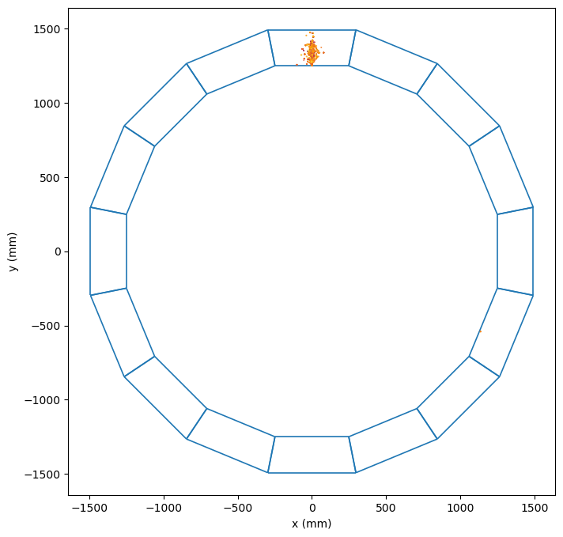

### Module 9 Cell View With Shower Overlay

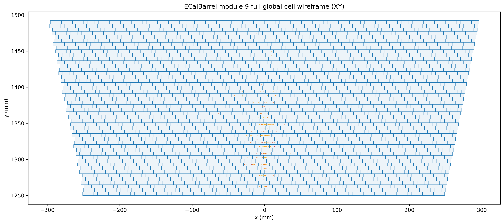

### Module 9 Sensitive-Only Cell View


## Units used in the plots

The example HDF5 files in this repository are produced by [step2point dataset repository](https://gitlab.cern.ch/fastsim/step2point/-/tree/v1.1.0?ref_type=tags), which preserves the EDM4hep values directly:

- deposited energy is plotted as `GeV`
- time is plotted as `ns`
- positions and shower-shape coordinates are plotted as `mm`

NOTE:
This matters only for axis labels and interpretation of the plots. The reclustering/compression code itself does not assume a special unit system: it preserves the units present in the input arrays. If an input dataset used different but internally consistent units, the compressed output would remain in the same units.

# Validation results

## EM showers

Animation below shows an example of a single electromagnetic shower:

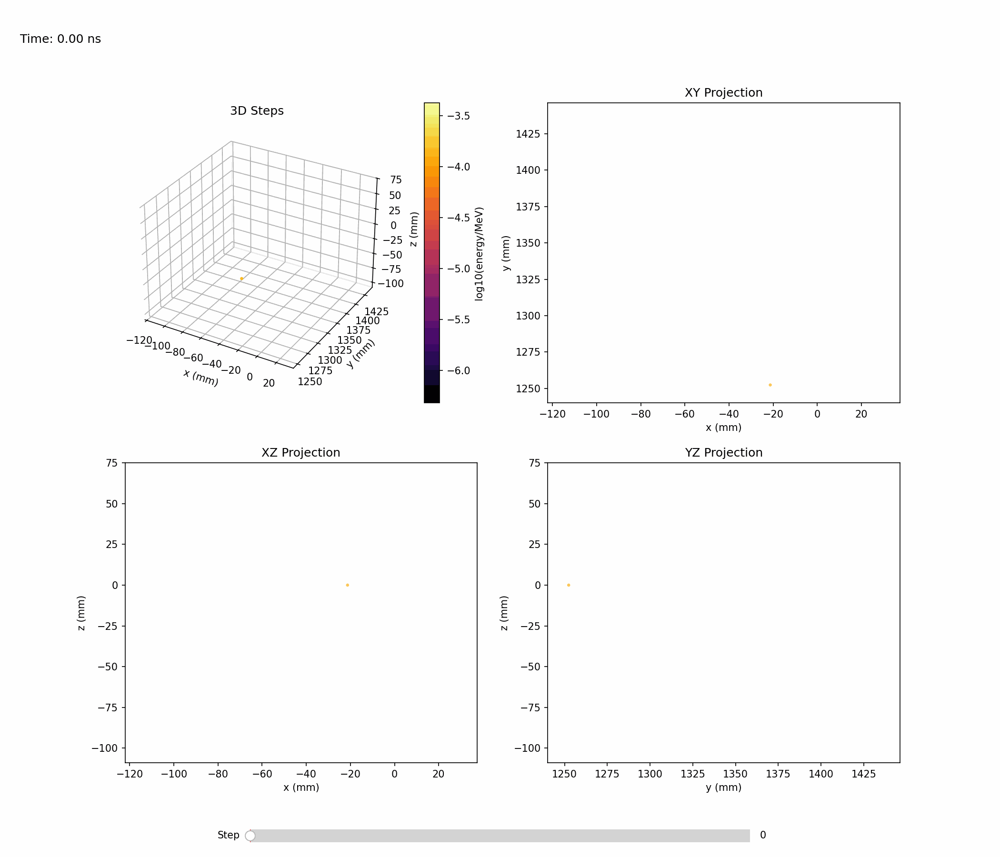{ .animation-gamma }

Single-shower inspection outputs produced with `--shower-index 0` on the gamma sample:

### Projections

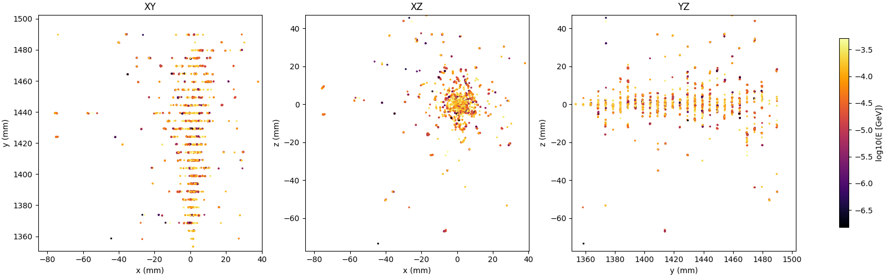

### Distributions

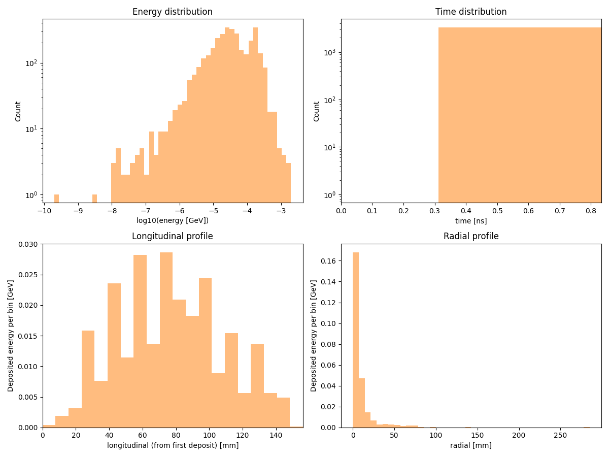

### Overview

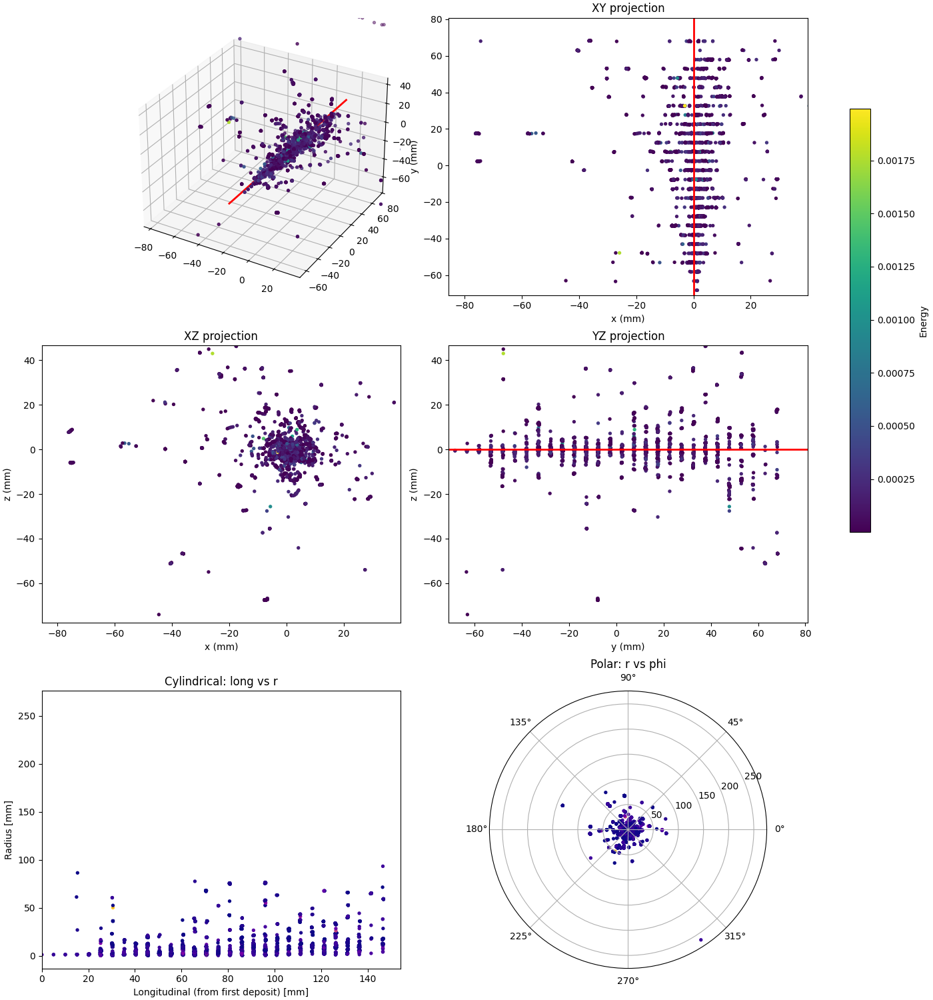

### Dataset observables matrix

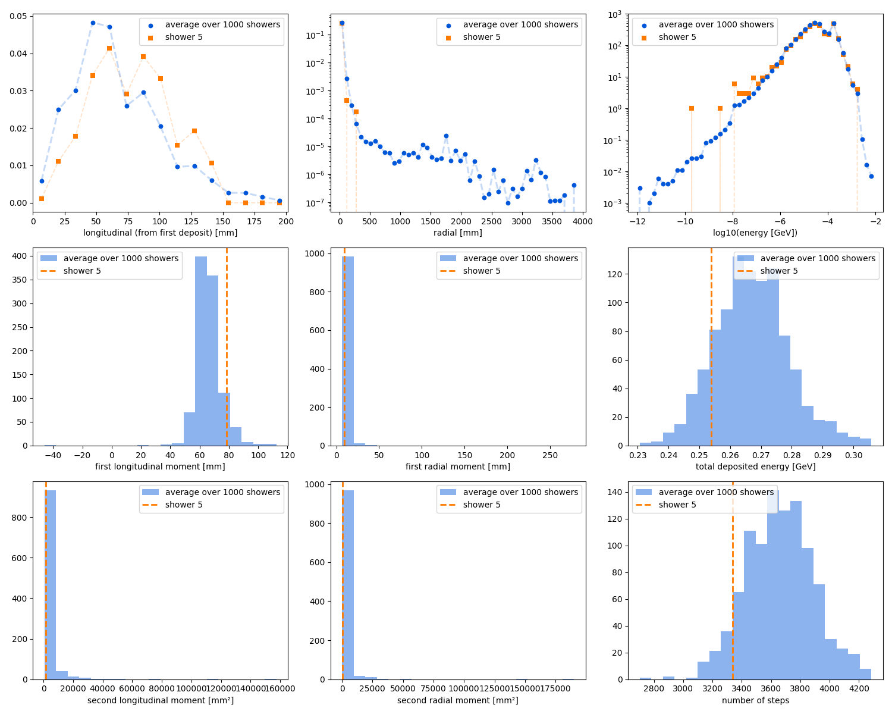

## hadronic showers

Animation below shows an example of a single hadronic shower:

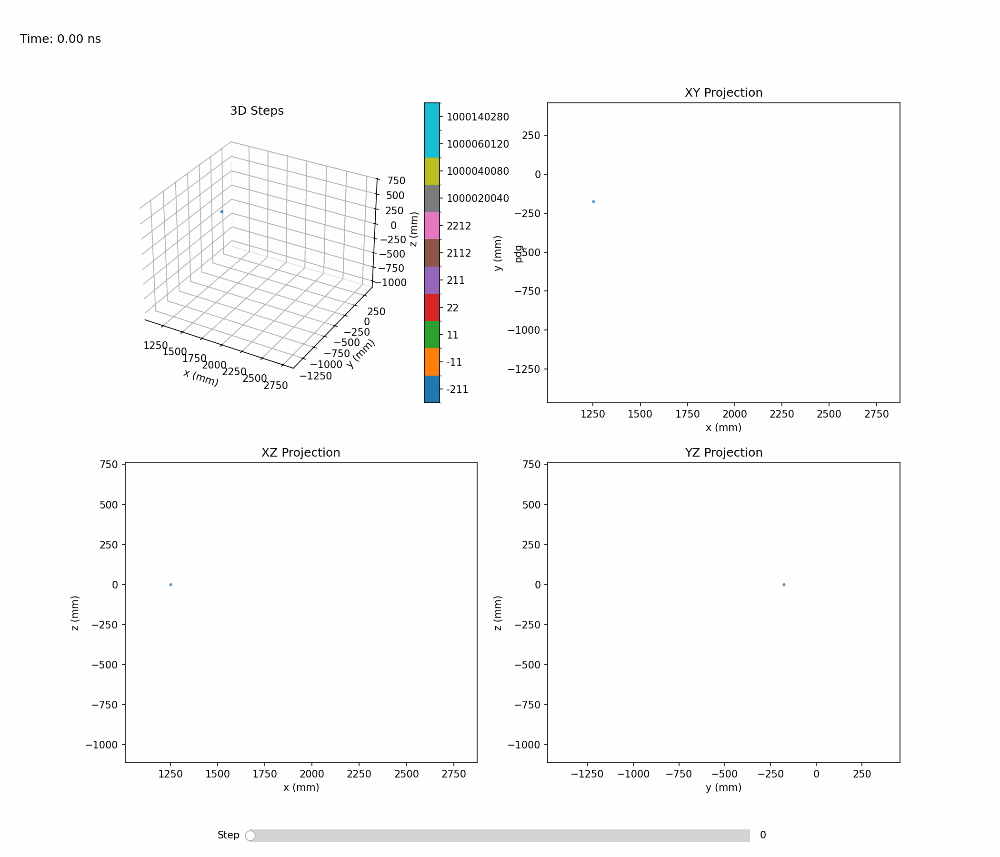{ .animation-pion }

Single-shower inspection outputs produced with `--shower-index 0 --axis 0 1 0` on the pion sample:

### Projections

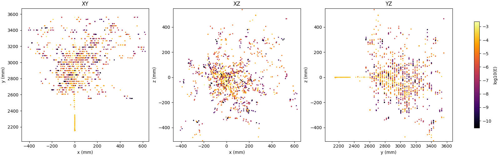

### Distributions

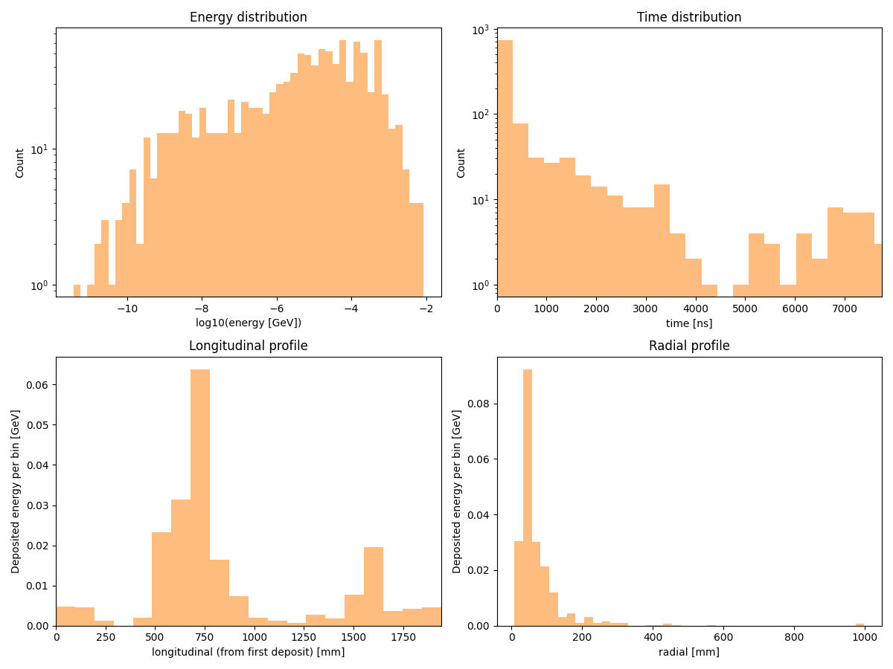

### Overview

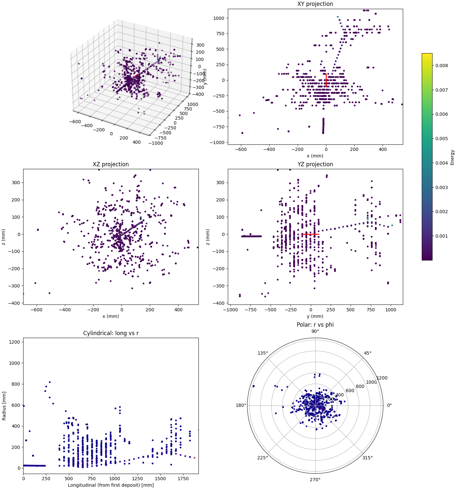

### Dataset observables

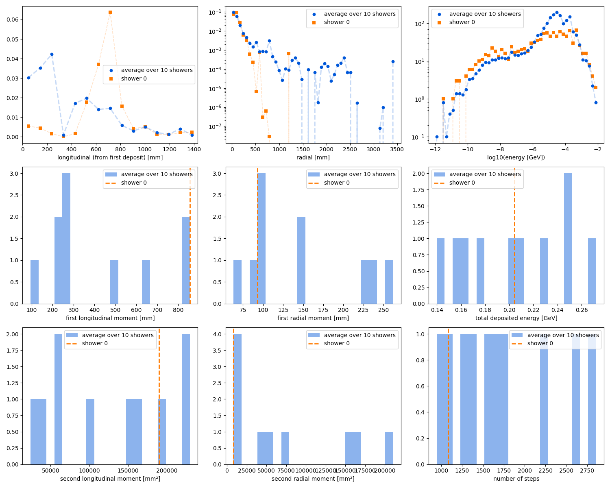
